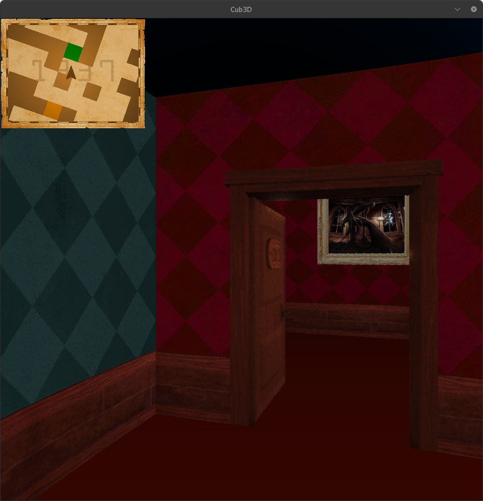

# cub3D

## Description

**cub3D** is a 3D raycasting engine inspired by classic games like *Wolfenstein 3D*. It renders a 3D world from a 2D grid using raycasting techniques, providing a first-person perspective for maze exploration. This project is part of the **42 Network curriculum** and is written entirely in **C**, leveraging the **MiniLibX** graphics library.

---

## Features

- **Raycasting Engine**: Renders a 3D environment from a 2D map using raycasting.
- **Texture Mapping**: Applies textures to walls, floors, and ceilings for a realistic look.
- **Interactive Doors**: Doors that can be opened or closed using player interaction.
- **Player Movement**: Smooth movement controls (forward, backward, strafe left/right).
- **Camera Rotation**: Rotate the camera using arrow keys or mouse movement (bonus feature).
- **Minimap**: Displays a 2D minimap for easier navigation.
- **Sprite Rendering**: Supports animated sprites for dynamic objects.
- **Collision Detection**: Prevents the player from walking through walls.

---

## Installation
